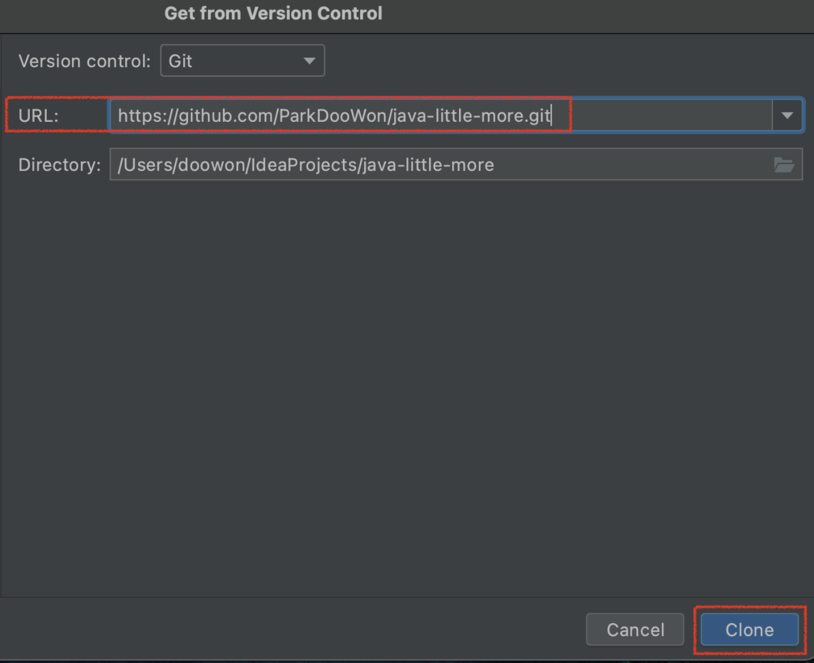
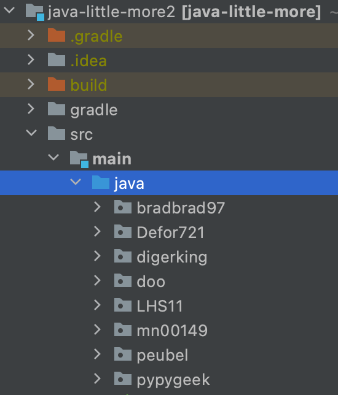
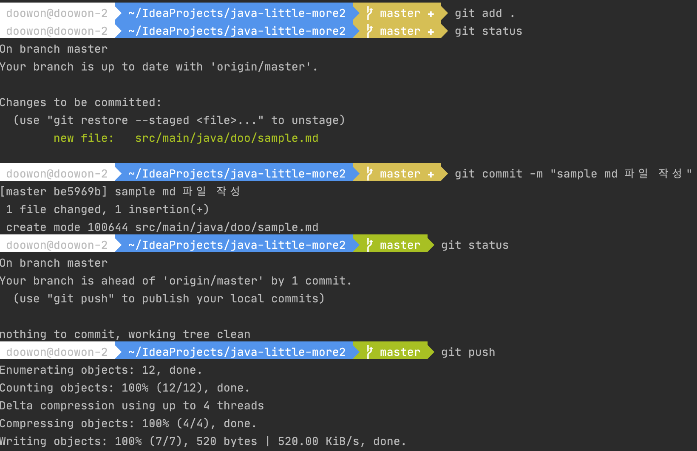
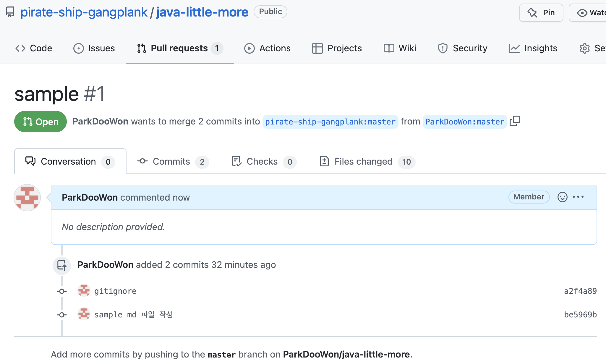

# PR 보내는 법

## 1. fork

초대 받은 [java-little-more](https://github.com/pirate-ship-gangplank/java-little-more) 저장소를 fork 합니다.

링크를 통해 들어간 후에 오른쪽 상단 `Fork` 를 누르고, 바뀐 화면의 왼쪽 하단 `Create fork` 초록색 버튼을 눌러서 fork 해줍니다. 그러면 `본인의 계정명/java-little-more` 저장소가 생겼을 거에요 🙂

</img> 

## 2. clone

fork 후에 생성된 각자의 코드 저장소에서 `Code` 초록색 버튼을 누르고, 보이는 url 링크를 복사합니다.
</img> 

이제 intelliJ를 켜서 `Get from Version Control` 을 눌러줍니다.

그리고 URL에 아까 복사한 링크를 붙여넣기 하고, `Clone` 버튼을 눌러서 clone 합니다.

</img> 

[이클립스인 경우 참고해주세요](https://hgko1207.github.io/2020/05/18/eclipse-git-clone/)

## 3. 코드 저장하기

스터디원분들의 github 계정의 아이디를 디렉토리명으로 만들어뒀습니다.

각자의 github 아이디에 해당하는 디렉토리 안에서 md(마크다운) 파일이나 예제 코드를 작성해주시면 됩니다.
(md 파일의 경우, 노션에 정리한 내용을 그대로 복붙하면 대부분의 내용은 자동으로 옮겨집니다. 하지만, 사진 등의 그렇지않은 부분도 있으니 [md 작성법](https://gist.github.com/ihoneymon/652be052a0727ad59601) 글을 읽고 참고해주세요.)   
</img> 

스터디 내용을 모두 정리했다면, 이제 코드를 저장소에 올려보겠습니다.

1. IDE에 있는 터미널창에서 `git add .` 명령을 입력하면 현재 디렉터리 아래의 모든 파일이 저장될 준비가 됩니다.
    - `git add [추가할 파일 경로]` 명령을 입력하면 특정 파일만 추가됩니다.
    - 파일이 제대로 올라갔는지를 보려면 `git status` 명령으로 파일이 제대로 추가됐는지 확인할 수 있습니다.
2. `git commit -m “작성하고자하는 커밋 메세지”` 명령을 입력하면 commit이 됩니다.
3. `git push` 명령으로 각자의 저장소에 커밋한 내용을 올립니다.
    - push할 때 `Support for password authentication was removed on August 13, 2021. Please use a personal access token instead.` 이런 에러가 발생하면서 push가 되지 않는다면, 토큰 생성이 필요하니 [토큰 만드는 방법](https://amkorousagi-money.tistory.com/entry/Git-personal-access-token)을 참고해서 push 해주세요.

</img> 

## 4. PR 보내기

1. 내 저장소에서 `Pull requests`를 누르고, `New pull request` 초록색 버튼을 누릅니다.   
</img> 
2. **head repository가 본인 저장소**이고, **base repository가 pirate-ship-gangplank**가 맞는지 확인하고, `Create pull request`를 누릅니다.   
</img> 
3. PR의 title을 입력해주고, 마지막으로 `Create pull request`를 누르면 PR이 보내집니다.   
</img>  

결과
 
</img> 
 