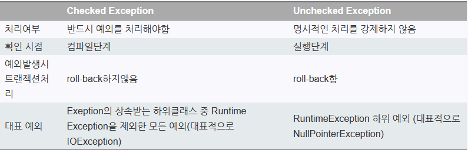

# Step 02. 예외 처리 기본 - NullPointerException 그리고 StackTrace

## Situation1. 예외처리를 하지 않았을 때

    public class ExceptionHandling {
        public static void main(String[] args) {
                method1();
                System.out.println("Main Ended");
            }
        
            private static void method1() {
                method2();
                System.out.println("Method1 Ended");
            }
        
            private static void method2() {
                String str = null;
                str.length();
        
                System.out.println("Method2 Ended");
            }
        }

> 결과 : 에러를 나타내는 Stack Trace 문구 외엔 출력문이 동작하지 않는다.

---

# Step 03. 예외 처리 기본 - try 와 catch

## Situation2. 예외처리를 부분적으로 해주었을 때

    public class ExceptionHandling2 {
        public static void main(String[] args) {
                method1();
                System.out.println("Main Ended");
            }
        
            private static void method1() {
                method2();
        
                System.out.println("Method1 Ended");
            }
        
            private static void method2() {
        
                // 실행
                try {
                    String str = null;
                    str.length();
        
                    System.out.println("Method2 Ended");
                }
                // 예외 발생 시의 동작
                catch (Exception exception) {
                    
                    //전체 Stack Trace 를 출력한다.
                    exception.printStackTrace();
                }
            }
        }

> 결과 : 
> java.lang.NullPointerException: Cannot invoke "String.length()" because "str" is null
at digerking.ExceptionHandling.ExceptionHandling2.method2(ExceptionHandling2.java:21)
at digerking.ExceptionHandling.ExceptionHandling2.method1(ExceptionHandling2.java:11)
at digerking.ExceptionHandling.ExceptionHandling2.main(ExceptionHandling2.java:5)

> Method1 Ended
> 
> Main Ended

### try -> 실행할 메서드, 문장 입력
### catch -> try 블럭에서 예외가 터졌을 때 취할 행동을 입력

---
# Step 04. 예외 처리 기본 - 예외 처리 순위, Matching 과 Catc

### NullPointException -> RuntimeException -> Exception
### -> 는 상위 클래스 방향을 말함

    private static void method2() {
        // 실행
        try {
            String str = null;
            str.length();
            System.out.println("Method2 Ended");
        } 
        
        // 예외 발생 시의 동작
        catch (NullPointerException exception) {
            System.out.println("NullPointerException");
            exception.printStackTrace();
        }

        // 예외 발생 시의 동작
        catch (Exception exception) {
            //전체 Stack Trace 를 출력한다.
            exception.printStackTrace();
        }
    }

catch() 에서 ()안에 특정 구체적인 예외를 명시해주면, 그 예외에 대한 처리를 해주게된다.

> 예외를 넣어줄 때 상위 클래스인 RuntimeException, Exception 을 넣어줘도 커버 되지만
> 
> 구체적으로 예외가 터지는 상황을 명시해 주기 위해 하위 클래스를 명시해 준다.

---

# Step 05. 예외 처리 기본 - finally 의 필요성

    public class Finally {
        public static void main(String[] args) {
        
                Scanner scanner = new Scanner(System.in);
        
                try {
                    int[] numbers = {1, 2, 3, 4, 5};
                    int number = numbers[2];
        
                    System.out.println("Before Scanner Close");
        
                    scanner.close();
                }
        
                catch (Exception exception) {
                    exception.printStackTrace();
                }
        
                // 예외 처리를 한 후 수행할 코드들
                finally {
                    System.out.println("Before Scanner Close");
                    scanner.close();
                }
        
                System.out.println("Just Before closing out main");
            }
    }

> finally 키워드는 예외가 발생하건 아니건 상관없이 실행 시키고 싶은 문장을 넣어 사용한다.

---

# Step 06. 예외 처리 기본 - 퀴즈

## Question 1. 
### will finally be executed in the program below?

 

    private static void method2() {
        Connection connection = new Connection();
        connection.open();

        try {
            String str = null;
            str.toString();
            return;
        } catch (Exception e) {
            connection.close();
        }
    }

> Answer 1) connection.close(); 가 실행된다.

> ** comment
> 
> 만약 try 블럭의 내용이 예외가 터지지 않아서, 
> 
> return 문이 돌아가도 finally 문은 정상적으로 실행이 된다.

 

## Question 2. 
### When is code in finally not executed?

 

> Answer 2) 
> 
> 1. finally 블럭내의 코드가 예외가 터진다면 finally 구문은 실행되지 않는다.
> 
> 2. 또한 JVM Crash 상황일 때 finally 코드가 실행되지 않게 된다.
> 
>   --> System.exit(1); // 실행금지!!

---

 

## Question 3.
### Will code compile?

 

    private static void method2() {
        Connection connection = new Connection();
        connection.open();

        try {
            String str = null;
            str.toString();
            return;
        }
        finally {
            connection.close();
        }
    }

> Answer 3)
> 
> try 후 catch 블럭이 없기 때문에 컴파일 오류가 발생한다.

---

# Step 07. 점검 예외 처리 vs 비 점검 예외 처리 - 예시

    public class CheckedException {
        public static void main(String[] args) {
        
                // #1. 아무런 처리 없이 Thread.sleep(2000); 가 컴파일 오류가 발생하는 이유
                // #1. sleep 이라는 메서드 자체가 InterruptException 예외를 터뜨릴 수 있다.

                // #1. 해결방법 1
                try {
                    someOtherMethod();
                    Thread.sleep(2000);
                } catch (InterruptedException e) {
                    e.printStackTrace();
                }
            }
        
            // #2. 해당 메서드를 호출하는 클래스에서, 이미 예외를 처리했어도
            // #2. 해당 메서드에서 예외처리가 되어있지 않기 때문에 컴파일 오류가 발생한다.
        
            // #2. throws InterruptedException 으로 해결
            private static void someOtherMethod() throws InterruptedException {
                Thread.sleep(2000);
            }
    }

1. 실제 메서드 선언부에 throws 키워드와 예외를 함께 명시해 주는 방법
2. 메서드 본문에 try-catch 로 예외를 처리하는 방법
---

# Step 08. 오류의 순위, 예외 - Checked, Runtime

### Error vs Exception

> Error 는 프로그래머가 처리할 수 없는 오류를 의미한다. (메모리 고갈, Overflow 등 ...)
> 
> Exception 은 프로그래머가 처리할 수 있는 상황

    class Error extends Throwable{} // Error

    ---
    
    class Exception extends Throwable{} // Exception
    
    class InterruptedException extends Throwable{}
    
    class RuntimeException extends Exception{}
    
    class NullPointerException extends RuntimeException{}

 

> Exception 하위 클래스 중, **RuntimeException** 이 아닌 예외들은
> 
> Checked Exception(점검 예외)라고 부른다.
> 
> 상속관계로 인해 Exception 의 하위 클래스에 해당하는 예외는 모두 checked 로 볼 수 있다.

### 예외 간에도 우열이 존재하며, 가장 상위 클래스는 Throwable 이다.

---

# Step 09. 예외 처리 던지기

    class Amount {
        private String currency;
        private int amount;
    
        public Amount(String currency, int amount) {
            this.currency = currency;
            this.amount = amount;
        }
    
        public String toString() {
            return amount + " " + currency;
        }
    
        public void add(Amount other) {
            this.amount = this.amount + other.amount;
        }
    }

    public class ThrowingException {
        public static void main(String[] args) {
            Amount amount1 = new Amount("USD", 10);
            Amount amount2 = new Amount("EUR", 20);
            
            amount1.add(amount2);
            
            System.out.println(amount1);
        }
    }

> 위 코드를 실행시키면, 본래 의도인 EUR 화폐로 바꿔 출력되는 것이 아닌
> 
> USD 라는 통화 단위가 출력된다. -> 사용자가 입력을 잘 못해줌을 알려주어 올바르게 동작하도록 해야한다.

 

### Amount 클래스의 메서드 수정 -> add 메서드에 예외 추가 (RuntimeException)

    public void add(Amount that) {

        if (!this.currency.equals(that.currency)) {
            throw new RuntimeException("Currencies Don't Match");
        }

        this.amount = this.amount + that.amount;
    }

> 메서드 내부에서, 특정 조건에 관한 예외를 던지게 한다.

---
# Step 10. 예외 처리 Throw

### Amount.java

    public void add(Amount that) {

        if (!this.currency.equals(that.currency)) {
            throw new Exception("Currencies Don't Match");
        }

        this.amount = this.amount + that.amount;
    }

> 위 코드는 컴파일 에러가 난다. 왜일까?

### Checked Exception 을 예외로 던지는 경우, 메서드에 명시를 꼭 해주어야 한다.

#### 여기서 Checked Exception 이란?

https://ooo.0o0.ooo/2016/06/20/5768c606cf9cb.jpg

위 표로 설명 대체

### Checked Exception 처리 반영 후 Amount.java

    public void add(Amount that) throws Exception {

        if (!this.currency.equals(that.currency)) {
            throw new Exception("Currencies Don't Match");
        }

        this.amount = this.amount + that.amount;
    }

> 컴파일 에러 제거

하지만 위 클래스에 담긴 메서드를 Main 클래스에서 사용하려면, 컴파일 에러가 발생한다.

마찬가지로 Main 메서드에도 throws Exception 을 추가해줘야 한다.

---

# Step 11. 사용자 정의 예외

    public void add(Amount that) throws Exception{
        if (!this.currency.equals(that.currency)) {
            // throw new Exception("Currencies Don't Match");
            throw new CurrenciesDoNotMathException();
    }
            this.amount = this.amount + that.amount;
        }
    }
    
    class CurrenciesDoNotMathException extends CurrenciesDoNotMathException {
    
    }

    public class ThrowingException {
        public static void main(String[] args) throws CurrenciesDoNotMathException {
            Amount amount1 = new Amount("USD", 10);
            Amount amount2 = new Amount("EUR", 20);
    
            amount1.add(amount2);
    
            System.out.println(amount1);
        }
    }

>     class CurrenciesDoNotMathException extends Exception { }

위 구문으로 사용자 정의 예외 클래스를 만들어 실행시키면 기존 예외 문구와 다르게 출력된다.

 

    class CurrenciesDoNotMathException extends Exception {
        public CurrenciesDoNotMathException(String message) {
            super(message);
        }
    }

> 추가적으로, 해당 클래스의 생성자에, super 키워드를 통해 메세지를 사용자가 정의하여 해당하는 메세지를 예외 메세지로 전달할 수 있다.

---

# Step 12. 코드 줄이기 (Java7)

    import java.util.Scanner;
    
    public class TryWithResources {
        public static void main(String[] args) {
        
                try (Scanner scanner = new Scanner(System.in)) {
                    int[] numbers = {1, 2, 3, 4, 5};
                    int number = numbers[2];
                }
            }
    }

> 기존 try-catch-finally 코드에서 위와 같이 수정하기만 해도
> 
> Autocloseable 이라는 클래스를 실행하여 Close() 메서드를 자동으로 실행해준다.

---

# Step 13. 퀴즈 2

    try {
        AmountAdder.addAmounts(new Aomunt("RUPEE", 5),
            new Amount("RUPEE", 5));

        String string = null;
        string.toString();
    }
    catch (CurrenciesDoNotMatchException e) {
        System.out.println("Handled CurrenciesDoNotMatchException");
    }

> 위 코드에 NullPointException 을 던진다면 어떻게 될 것인가?

#### 컴파일 되지 않는다.
#### NullPointerException 에 관한 예외를 직접 처리해주어야 한다.

---

# Step 14. 정리

### 1. 예외를 숨기지 말자 (Stack Trace Log 찍어보기)
### 2. 흐름 제어를 위해 사용하지 말자 (if 문과 달리 비용이 많이 드는 구문이므로 남발하지 않기)
### 3. 예외상황에서 최종 사용자(개발자)를 위해 어떻게 처리를 해줘야하는가
### 4. 예외발생 시 calling 메서드
### 5. Global Exception Handling (예외를 하나하나 다루는 것이 아닌 총괄할 수 있도록 구조를 만들자)